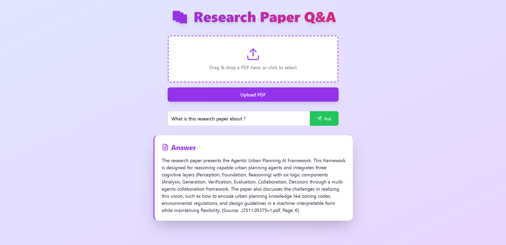

# Research Paper Assistant (RAG for Literature Review)

A **Retrieval-Augmented Generation (RAG)** tool to assist researchers in literature review by semantically searching, summarizing, and extracting insights from research papers.

## Features

- Upload and process PDFs of research papers
- Semantic search over documents
- Generate summaries and extract key insights
- Uses OpenAI GPT as the language model backend
- Vector storage with Chroma for fast similarity search

## Tech Stack

- **Backend:** Python, FastAPI
- **Vector Store:** Chroma
- **LLM:** OpenAI GPT
- **PDF Processing:** PyMuPDF
- **Environment Management:** python-dotenv for API keys

## Web Page Screenshot

---